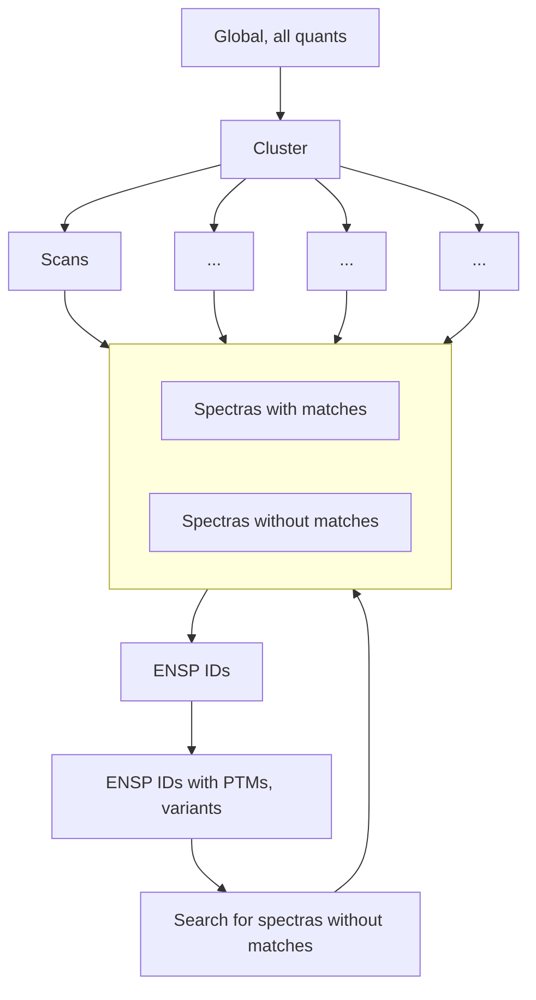

```mermaid
graph TD;
    GlobalAllQuants[Global, all quants] --> Cluster;
    Cluster --> Scans1[Scans];
    Cluster --> Scans2[...];
    Cluster --> Scans3[...];
    Cluster --> Scans4[...];
    Scans1 --> MatchesAndDark;
    Scans2 --> MatchesAndDark;
    Scans3 --> MatchesAndDark;
    Scans4 --> MatchesAndDark;
    MatchesAndDark --> ENSP_IDs[ENSP IDs];
    ENSP_IDs --> ENSP_IDs_with_PTMs[ENSP IDs with PTMs, variants];
    ENSP_IDs_with_PTMs --> DarkSearch[Search for spectras without matches];
    DarkSearch --> MatchesAndDark;

    subgraph MatchesAndDark[ ]
        Matches[Spectras with matches]
        Dark[Spectras without matches]
    end

```
